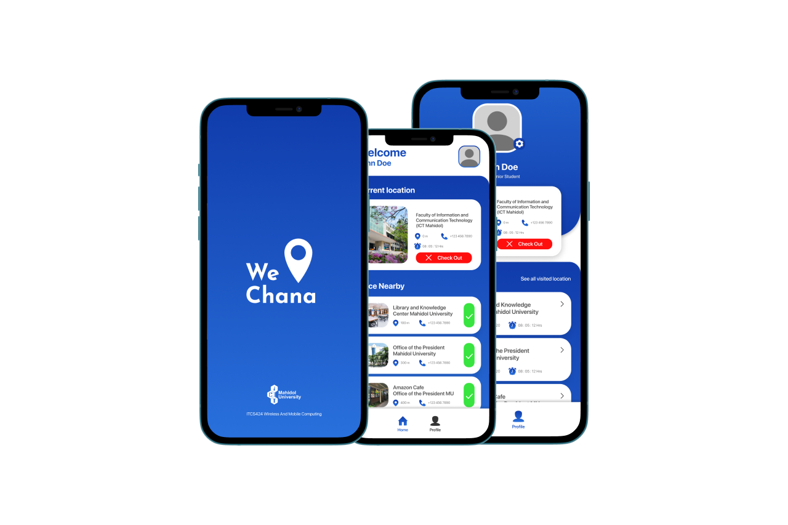

# WeChana

  

WeChana, a mobile application for logging users' presences at a location using GPS technology to identify places where people can easily check-in without scanning QR codes, making it more convenient for people to check in. In addition, to encourage people's social responsibility during the COVID-19 pandemic by using this mobile application.

## Contributors

| ID      | Name                   |
| ------- | ---------------------- |
| 6288087 | Supakarn Laorattanakul |
| 6288123 | Thanaboon Sapmontree   |

